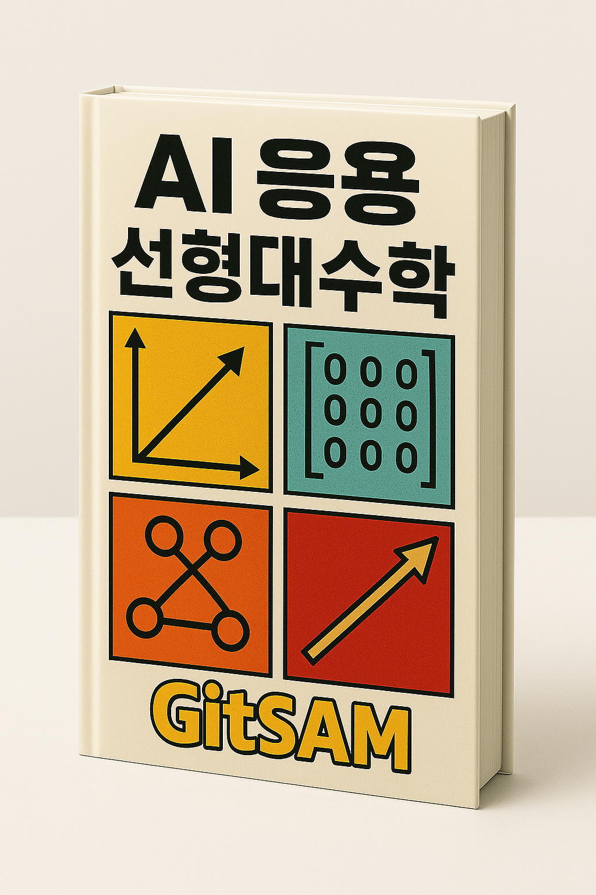

## Preface

{width=300}

우리는 “외국인 직접투자가 증가하면 경제성장률도 상승할까?” 

> 모든 모형은 틀렸다. 다만, 몇몇 모형은 유용하다.  

이러한 인식이 통계학의 출발점이며, 합리적 사고를 위한 훈련의 첫 걸음입니다.

## 목차 (Contents)

- 통계 데이터 (Statistical Data)
  - 경제지표 (Economic indicators)
