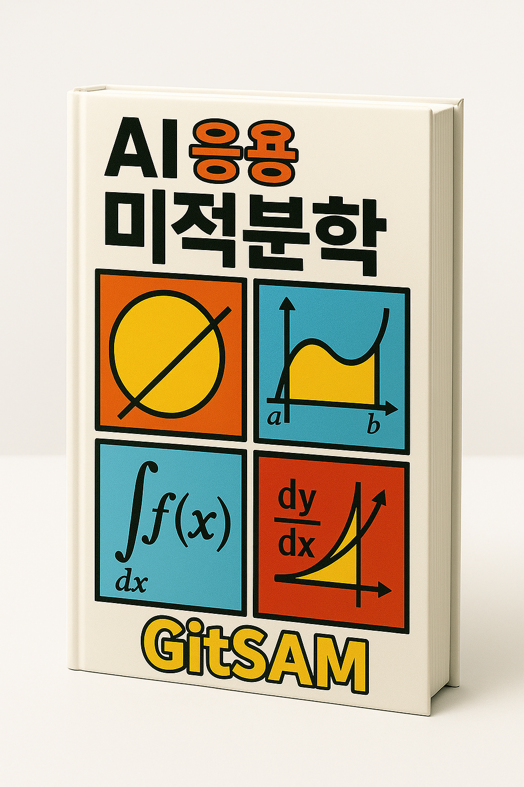

{width=300}

## Preface

3가지 예제 (Cycloid–Catenary, Mean-Variance, Kalman-filter)

- **대상**: 경제학/AI 분야 전공자 또는 대학생, 연구자  
- **난이도**: 중상 (대학 2학년 이상)  
- **교재 기반**:  
  - Stephen Boyd – *Convex Optimization Theory* (Stanford)  
  - Javier Sánchez – *All Models Are Wrong* (Berkeley)  
- **사용 도구**: Python (NumPy, SciPy, Matplotlib, PyTorch), Google Colab  
- **결과물 중심**:  
  - 최적화 알고리즘 구현  
  - 간단한 머신러닝 모델 수학적 기반 이해  
  - 논문 읽기/작성에 필요한 이론 훈련  

> **[홍보 문구]**  
> “AI의 수학, 논문 한 줄 한 줄이 이해되는 수업.”  
> “스탠포드 최적화 + 버클리 통계, 이제는 당신 손 안에.”