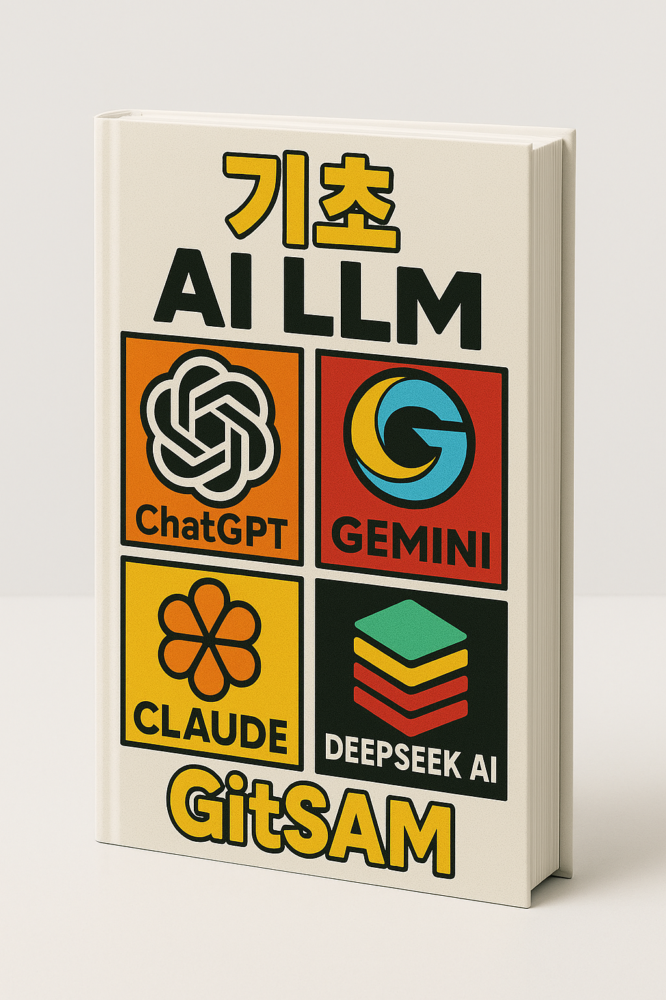
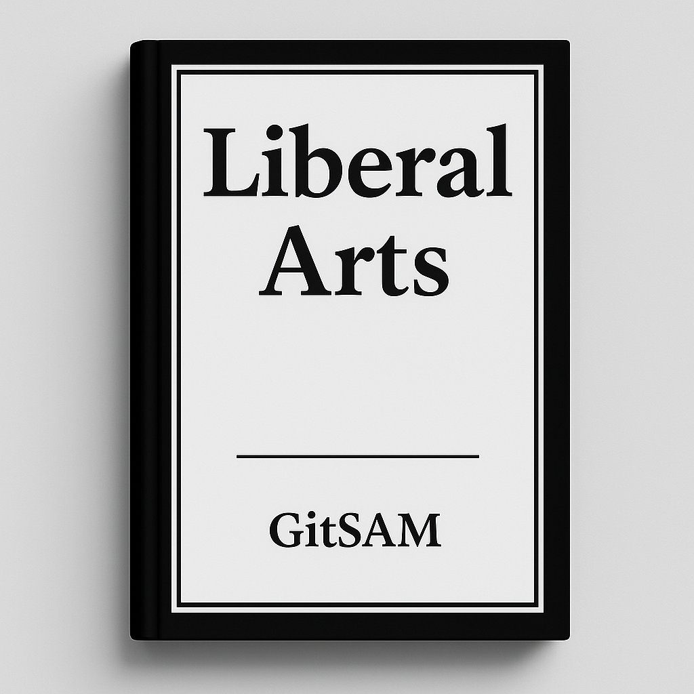
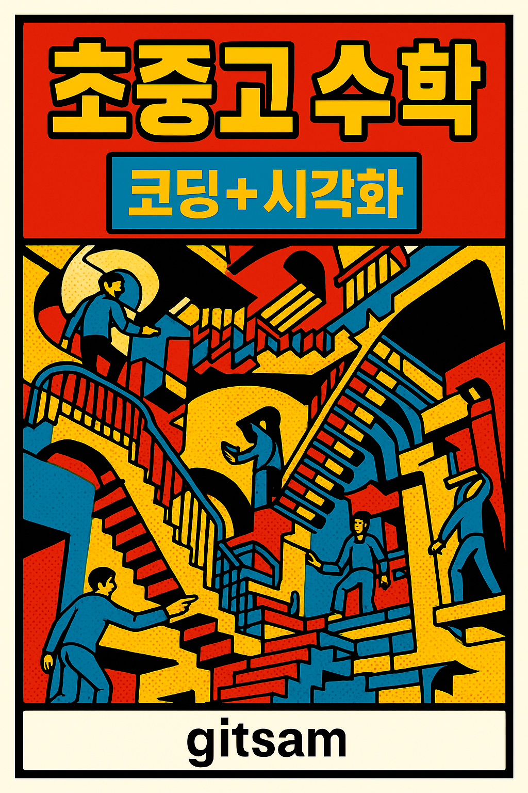
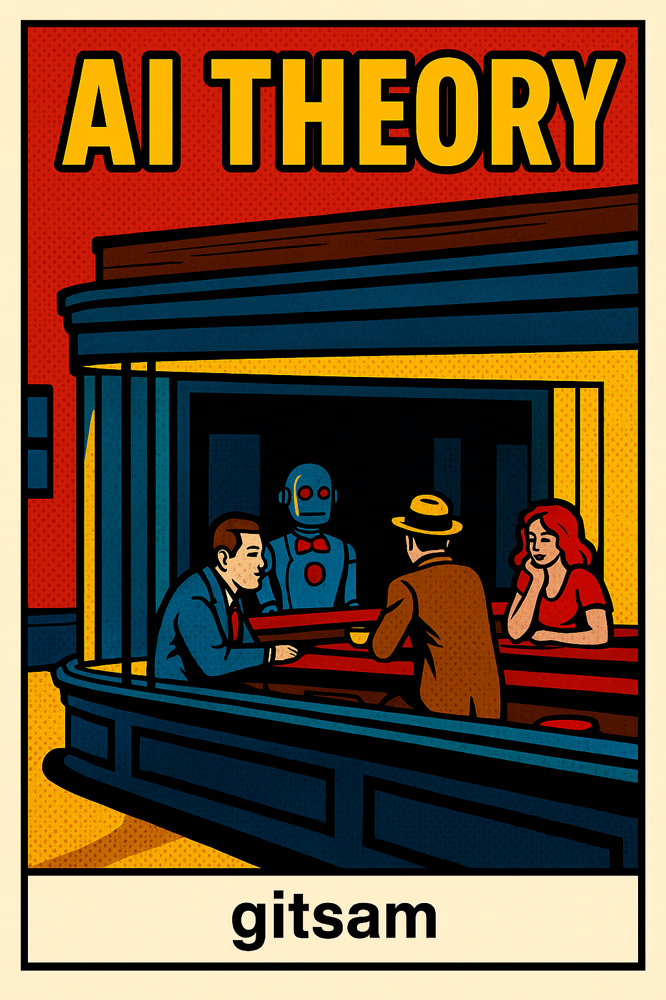
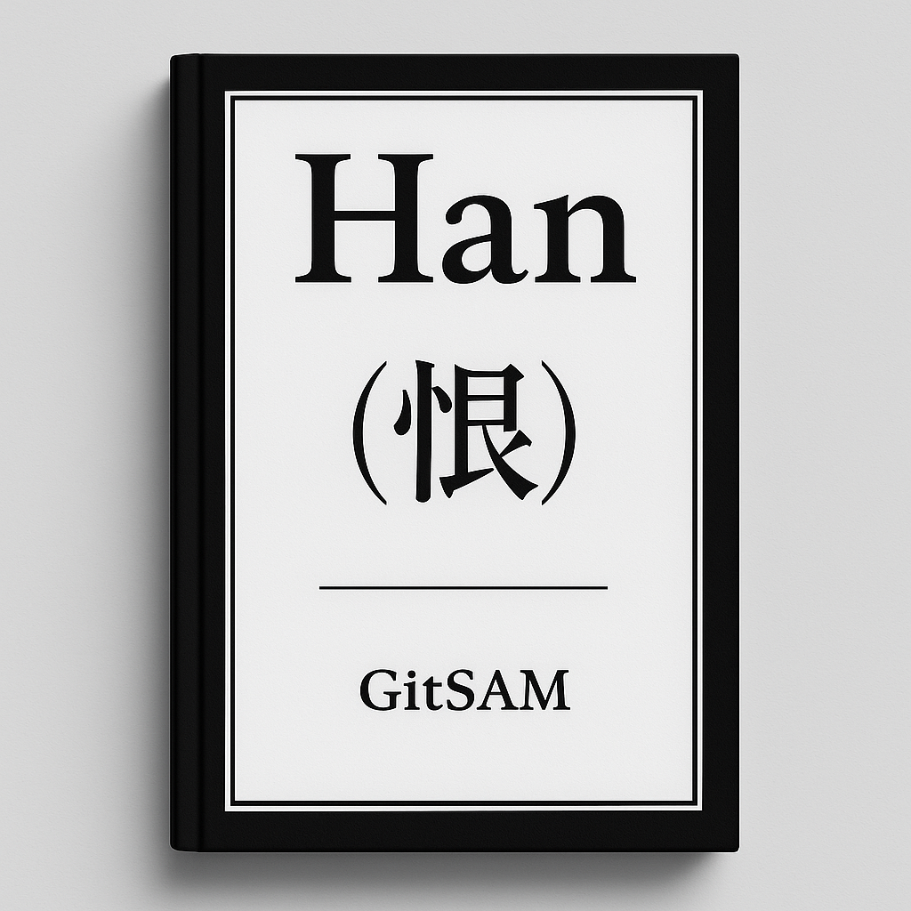

## Math is an effective language

- Formulate and Solve your problem
- Interpret and Test your solution

## Computer is an efficient tool

- Computation with Python in Colab
- Publication with Quarto in Local

## Apps (In progress)

- FinTech Dashboard vs. simplywall.st : Bayesian RL
- K-Learning vs. EBS Danchoo+ : simple DL model
- K-culture pod vs. runpod : Community based GPU cloud
- messenger vs. telegram : On-device small LM with RAG
- 벨벳토끼인형 vs. cati 인형 : On-device Socratic small LM with TTS

## Video Arts (In progress)

- stories, images and music by consistent character
- Platonic vs. Erotic

## Books (In progress)

<!-- 태그 필터 버튼 -->

  <button onclick="filterBooks('all')">All</button>
  <button onclick="filterBooks('basic')">초급</button>
  <button onclick="filterBooks('advanced')">고급</button>

  <a href="book-ai-algebra/index.html" target="_blank">
    
    
AI 응용 선형대수학

  </a>

  <a href="book-ai-calculus/index.html" target="_blank">
    
    
AI 응용 미적분학

  </a>

  <a href="book-ai-dev_log/index.html" target="_blank">
    
    
AI App 개발일지

  </a>

  <a href="https://gitsam.notion.site/ab09bfb8292b464a846d55e7d3df7a8d?v=18fd716ee0de80b89148000c8a8bb9f9" target="_blank">
    
    
gitsam 지식 산책

  </a>

  <a href="book-ai-stats/index.html" target="_blank">
    
    
AI 기초 통계학

  </a>

  <a href="book-ai-math/index.html" target="_blank">
    
    
AI 초중고 수학

  </a>

  <a href="book-ai-theory/index.html" target="_blank">
    
    
AI Theory

  </a>

  <a href="book-gitsam-han/index.html" target="_blank">
    
    
gitsam 글짓기

  </a>

<!-- 필요 시 카드 항목을 계속 추가 -->

