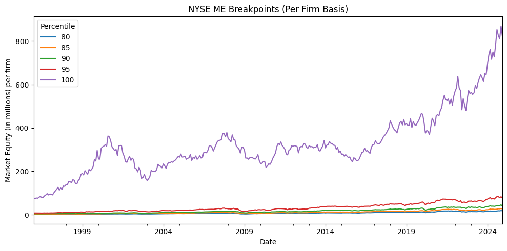
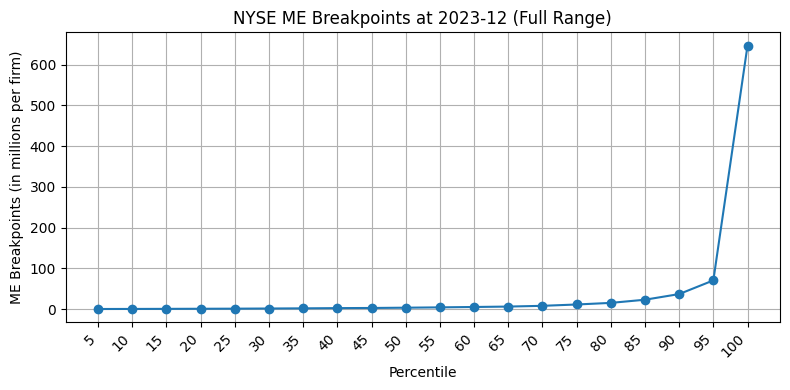
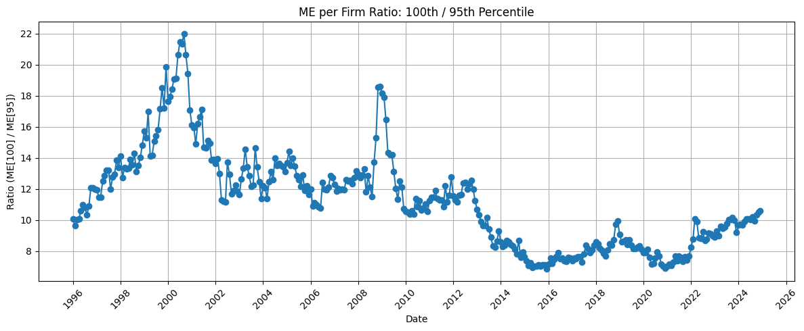

The NYSE continues to exhibit substantial market capitalization concentration. Since 2010 — and more sharply since 2016 — the very largest firms have distanced themselves even from the rest of the top 5%, highlighting the structural importance of tail dynamics in financial markets. Any realistic asset pricing model must account for this persistent and extreme upper-tail asymmetry.

## NYSE Market Equity Breakpoints: Long-Term Dynamics

The Fama-French dataset `ME_Breakpoints` provides monthly percentile breakpoints for market equity (ME), computed only from NYSE stocks. These breakpoints span from the 5th to the 100th percentile and are calculated based on market capitalization (price times shares outstanding, in millions of USD) at month-end. Importantly, closed-end funds and REITs are excluded, and only firms with CRSP share codes 10 or 11 and valid price/share data are included.

This file investigates the evolution of market concentration in the NYSE based on these ME breakpoints, emphasizing the dynamics in the upper tail of the distribution, particularly the top 5% of firms.

## Breakpoint Time Series per Firm (1996–2024)

We plot the NYSE ME breakpoints divided by the number of firms each month ("per firm") from 1996 to 2024. The results reveal two distinct phases:

- **Pre-2010:** A cyclical pattern dominates, consistent with broader economic expansions and contractions. For instance, the 2000–2001 tech bubble and the 2008 global financial crisis exhibit clear signals of expansion and collapse.
- **Post-2010:** A structural break is visible. Especially since 2016, the average ME per firm in the top percentile (100%) exhibits a sharp and persistent upward trend.

This long-term trend implies a sustained capital lock-in within a small number of mega-cap firms, increasingly distanced from the rest of the NYSE universe.

## Cross-Sectional Concentration at the Tail

To better understand the shape of the right tail, we visualize the percentile distribution at the most recent observation (2024-12). The result is striking: while the ME per firm grows gradually between percentiles 5 to 95, a dramatic jump occurs at the 100th percentile.

This highlights that **the concentration of market value within the top 5% is extreme**, and the very last percentile alone contains firms with ME per firm often an order of magnitude greater than those in the 95th percentile.

## Time Series of the Tail Ratio: 100th / 95th Percentile

To quantify tail concentration dynamics over time, we construct a monthly time series of the ME per firm ratio between the 100th and 95th percentiles. This ratio serves as a tail index for how dominant the very largest firms are, even among the elite.

The time series reveals the following:

- **1996–2001:** Rapid escalation during the dot-com boom, with the ratio peaking above 20.
- **2003–2008:** Stabilization around ~13.
- **2009:** A brief post-crisis surge back above 18.
- **2010–2016:** A sharp decline and plateau near 7, indicating relative equality among top-tier firms.
- **Post-2016:** A gradual resurgence in the ratio, reflecting renewed concentration at the very top.

## Broader Context: NYSE and the Top 5%

It is critical to underscore that Fama-French breakpoints are calculated **using only NYSE stocks**. Despite the rise of Nasdaq dominance in recent decades, the NYSE remains the foundation for constructing breakpoints in academic asset pricing.

The breakpoints for:

- **Market Equity (ME):** monthly, based on NYSE stocks with viable price and share data.
- **Book-to-Market (BE/ME):** annually, using BE from t-1 and ME from December of t-1.
- **Prior 2–12 month Return:** monthly, requiring CRSP price and return data.

These indicators, especially in the upper tail, are overwhelmingly driven by the top 5% of NYSE firms — roughly 60–70 firms. These companies exert outsized influence on asset pricing, portfolio construction, and market dynamics.

