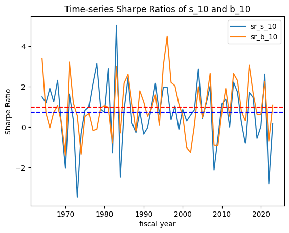
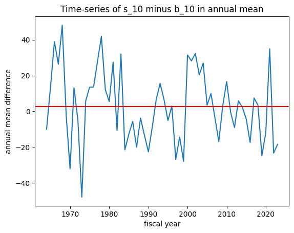
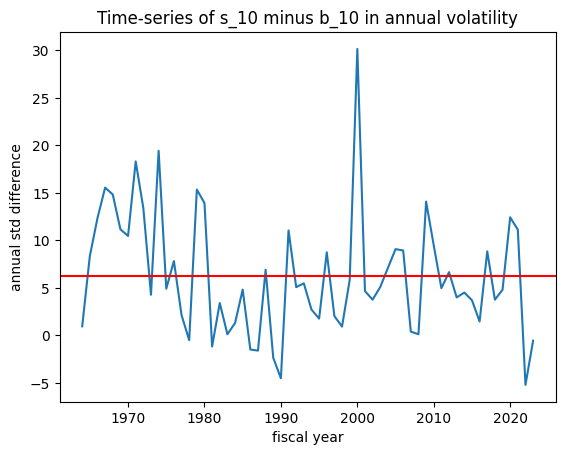
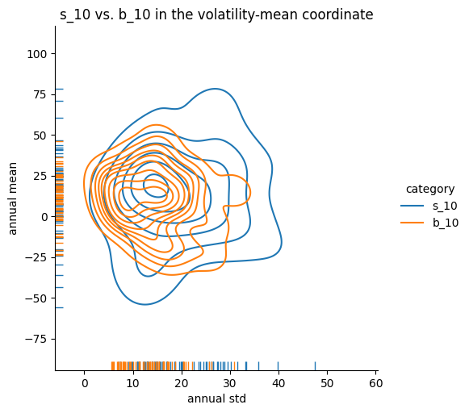
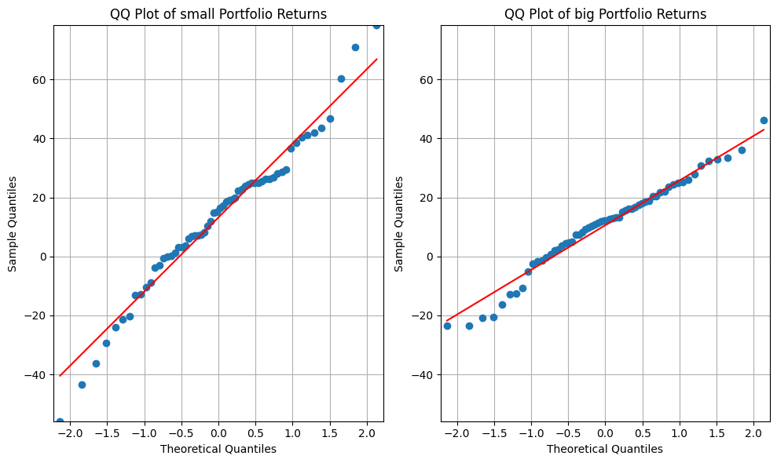

# Size-Momentum Benchmark: Size-Sorted Portfolios

To establish a structural benchmark for the TBTF strategy, we begin by examining the historical performance of size-sorted portfolios constructed by Fama and French. In particular, we compare the top and bottom deciles of market capitalization—commonly denoted as `b_10` (large-cap) and `s_10` (small-cap)—using monthly return data spanning from July 1963 to June 2023.

The data originate from the "Portfolios Formed on Size (ME)" dataset provided by the Ken French Data Library. These portfolios, covering NYSE, Nasdaq, and AMEX stocks, are rebalanced annually using NYSE breakpoints and report monthly **value-weighted excess returns**—i.e., returns net of the one-month Treasury bill rate (risk-free return).

For additional robustness, we construct aggregates (e.g., `s_70`, `s_90`) to represent broader small-cap behavior.

## Motivation

This section evaluates whether large-cap portfolios exhibit systematically superior **risk-adjusted performance** relative to small-cap portfolios. Such a result would support the hypothesis that TBTF-style strategies derive their advantage not from tactical optimization, but from structural features of the cross-sectional return distribution.

## Methodology

We compare the `s_10` and `b_10` portfolios in three dimensions:

- **Distributional Shape**: via QQ-plots and skewness asymmetry  
- **Volatility Profile**: through standard deviation comparisons  
- **Sharpe Ratio Dynamics**: using time-varying rolling Sharpe ratio curves and volatility–mean coordinate plots

Unlike most academic studies that summarize portfolio performance using static points in mean–volatility space, we propose a dynamic framework in which Sharpe ratios are evaluated as time-series objects. This allows us to capture persistent structural asymmetries.

## Key Findings

1. The `b_10` portfolio exhibits consistently lower volatility than `s_10`, across the full 60-year period.
2. Dynamic Sharpe ratio visualization reveals that the performance advantage of `b_10` is persistent over time, not a byproduct of a particular decade or business cycle.
3. QQ-plots show that `b_10` excess returns are closer to Gaussian, while `s_10` returns display tail asymmetry—characterized by positive skewness and negative tail risk.

These results suggest that large-cap portfolios, especially those at the very top of the capitalization spectrum, provide more stable and efficient **excess return profiles**. This supports the structural validity of selecting top-ranked assets by market capitalization in TBTF portfolio construction.

## Sharpe Ratio Dynamics

While static comparisons of mean and volatility offer useful summary insights, they can be misleading in the presence of temporal instability. To capture the **time-varying performance profile** of small- and large-cap portfolios, we construct **rolling Sharpe ratios** using annualized excess returns.

Let $\mu_t$ and $\sigma_t$ denote the rolling annualized **excess return mean** and **volatility** of a portfolio over a 36-month window. Then, the rolling Sharpe ratio at time $t$ is computed as:

$$
\text{Sharpe}_t = \frac{\mu_t}{\sigma_t}
$$

We focus on the bottom and top size deciles: `s_10` (small-cap) and `b_10` (large-cap).

### Key Results

- Over the 60-year period, the **unconditional average annual Sharpe ratio** of `b_10` was **0.99**, compared to **0.74** for `s_10`.
- The time-series of rolling Sharpe ratios reveals that `b_10` **dominates structurally**, not just in isolated windows.
- During periods of macroeconomic stress, `s_10` portfolios experience sharper volatility spikes, reducing their Sharpe ratios significantly.


*Time-series of 36-month rolling Sharpe ratios for `s_10` and `b_10`. Dashed lines represent the unconditional average for each.*

To further visualize the structural difference, we compare the time-series difference in annualized excess returns and standard deviations:


*Annual excess return difference: `s_10 – b_10`. The red horizontal line marks the long-run average (~3.0% annually).*


*Annual volatility difference: `s_10 – b_10`. Large-cap volatility is consistently lower.*

We also construct a bivariate distribution of annual mean and standard deviation using kernel density estimates:


*Kernel density estimate of annual excess return vs. annual volatility for `s_10` and `b_10`. The separation in volatility–mean space reflects the underlying Sharpe ratio asymmetry.*

These dynamic plots provide a richer understanding of the **persistent performance asymmetry** between the smallest and largest decile portfolios—supporting the broader structural thesis underlying TBTF.

## Contribution

- Introduces a time-dynamic framework—**Sharpe ratio level curves**—to visualize and quantify structural performance asymmetries between size portfolios.
- Establishes a long-term empirical benchmark against which TBTF performance can be evaluated.
- Provides theoretical and empirical justification for focusing on top-market-cap stocks, beyond simple momentum or value signals.

## Appendix {.appendix}

### Figure A1: QQ Plot – `s_10` vs. `b_10`



*QQ plots comparing sample quantiles of `s_10` (left) and `b_10` (right) returns to a standard normal distribution. The flatter slope and tighter fit of `b_10` indicate lower volatility and greater normality, while `s_10` exhibits positive skewness and negative tail risk.*

### Table A1: Summary Statistics (1963–2023)

```{=html}
<table border="1" class="dataframe">
  <caption><b>Annualized Summary Statistics for Fama-French Size-Decile Portfolios</b><br>
  Monthly value-weighted excess returns for size-sorted portfolios from July 1963 to June 2023. Excess returns are defined as raw portfolio returns net of the one-month Treasury bill rate.</caption>
  <thead>
    <tr style="text-align: right;">
      <th>Statistic</th>
      <th>s_10</th>
      <th>b_10</th>
      <th>s_20</th>
      <th>b_20</th>
      <th>s_30</th>
      <th>b_30</th>
      <th>s_70</th>
      <th>s_80</th>
      <th>s_90</th>
    </tr>
  </thead>
  <tbody>
    <tr><th>Count</th><td>360</td><td>360</td><td>360</td><td>360</td><td>360</td><td>360</td><td>360</td><td>360</td><td>360</td></tr>
    <tr><th>Mean</th><td>0.96</td><td>0.91</td><td>1.00</td><td>0.92</td><td>1.01</td><td>0.92</td><td>1.00</td><td>0.99</td><td>0.99</td></tr>
    <tr><th>Std. Dev</th><td>6.32</td><td>4.38</td><td>6.46</td><td>4.38</td><td>6.31</td><td>4.40</td><td>5.81</td><td>5.67</td><td>5.54</td></tr>
    <tr><th>Min</th><td>-22.21</td><td>-14.78</td><td>-23.06</td><td>-15.91</td><td>-23.56</td><td>-16.29</td><td>-22.58</td><td>-21.69</td><td>-21.23</td></tr>
    <tr><th>25%</th><td>-2.54</td><td>-1.62</td><td>-2.73</td><td>-1.64</td><td>-2.89</td><td>-1.67</td><td>-2.35</td><td>-2.40</td><td>-2.35</td></tr>
    <tr><th>Median</th><td>1.25</td><td>1.35</td><td>1.36</td><td>1.32</td><td>1.29</td><td>1.32</td><td>1.35</td><td>1.40</td><td>1.33</td></tr>
    <tr><th>75%</th><td>4.64</td><td>3.51</td><td>5.20</td><td>3.65</td><td>4.88</td><td>3.73</td><td>4.71</td><td>4.66</td><td>4.58</td></tr>
    <tr><th>Max</th><td>29.50</td><td>13.10</td><td>27.54</td><td>13.25</td><td>24.01</td><td>13.34</td><td>19.42</td><td>18.64</td><td>18.26</td></tr>
  </tbody>
</table>
